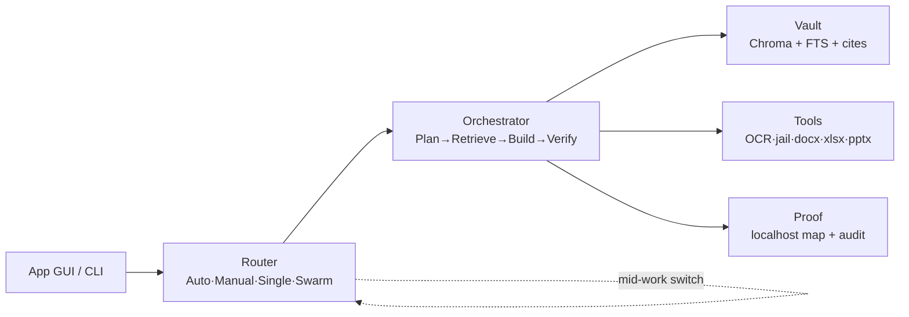

<div align="center">

# ⬢ HEDRON

[](https://github.com/PradipLalpura/Hedron)

**Sovereign on-premise agentic AI workbench — SIH26117 · MRPL · 100% local-first, no cloud exists.**

[](https://github.com/PradipLalpura/Hedron)
[](https://www.sih.gov.in/sih2026PS)
[](https://github.com/PradipLalpura/Hedron)
[](https://github.com/PradipLalpura/Hedron)

```text
  Engineer drops scan  ──▶  Hedron routes  ──▶  Real .docx/.xlsx  ──▶  Proof: 0 external
  (SOPs stay on disk)      (Qwen/Ornith/VL)     (cited, recalc-clean)    (cable-out demo ✓)
```

</div>

---

## ⚡ Demo in 60 seconds

> **Pull the LAN cable. Ask. Get cited Word + live Excel + verified code. See `external: 0`.**

| Commander Chat | Artifact Panel | Proof Badge |
|---|---|---|
| `Extract 3 defects from this scan + draft approval note` → `routed: qwen-vl-2b` | `.docx` opens in real Word, MRPL header intact | `● Local · 0 external · hashed` |
| `Pump 45kW blend 3:1, verify` → `routed: ornith-9b` → jail `PASS` | `.xlsx` with live `=SUM`, blue=input black=formula | every file BLAKE3-logged |

<details>
<summary><b>🏗 Architecture (click)</b></summary>



</details>

<details>
<summary><b>🧠 Model fleet (click)</b></summary>

| Role | Edge laptop 6GB | Workstation 24GB | Server 48GB+ |
|---|---|---|---|
| Docs | Qwen2.5-7B-Q4 | Qwen3-14B / GLM-4-9B | Llama-3.3-70B |
| Code | **Ornith-9B-Q4** | Ornith-35B-MoE | Ornith-397B |
| Vision | Qwen-VL-2B | Qwen-VL-7B | Qwen-VL-72B |
| Long docs | Qwen-3B | Kimi-K2-GGUF | Kimi / Qwen3-32B |

</details>

## 🚀 Run it

```bash
# 1. models (once, with internet)
ollama pull qwen2.5:7b && ollama pull hf.co/deepreinforce-ai/Ornith-1.0-9B-GGUF:Q4_K_M && ollama pull qwen2-vl:2b && ollama pull nomic-embed-text
# 2. app
pip install -r app/requirements.txt
python app/server.py & streamlit run app/app.py
# 3. venue: plug pendrive, double-click start.bat (copies to SSD, serves localhost)
```

## 🛡 Why Hedron

* **Sovereign** — no accounts, no keys, no egress allowlist. Unplug and keep working.
* **Grounded** — every line cites `[SOP p.X]` or says `not in SOP`. No invented metrics.
* **Beautiful, not slop** — your template wins; else Hallmark gates (overflow · contrast · recalc) fix before you see.
* **Autonomous** — router switches models mid-job on failure; Swarm races 2 builders and keeps the tested winner.

<div align="center">

*Built for SIH 2026 · Team Voltrix · MRPL problem statement 26117*

</div>
